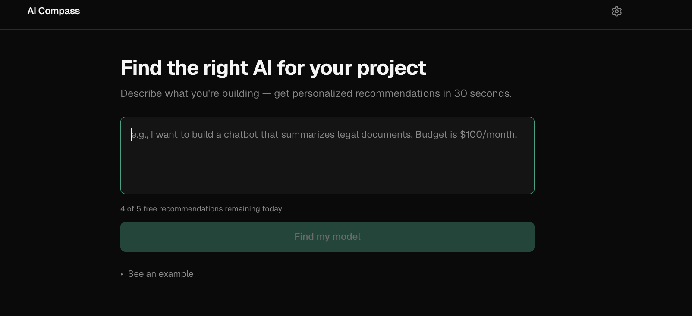
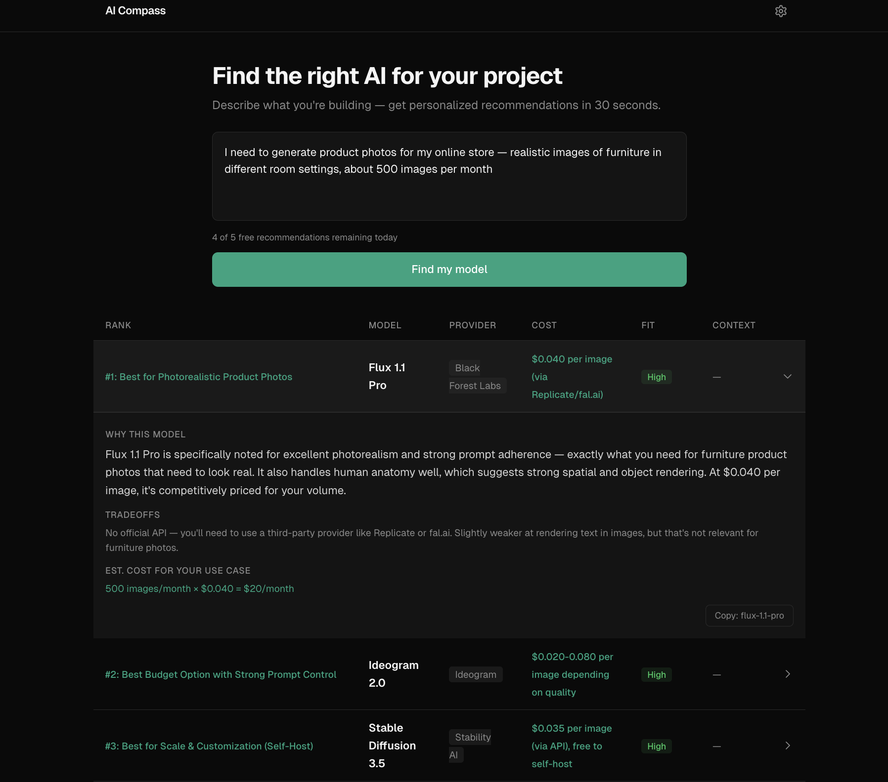

# AI Compass

**Describe what you're building, get the right AI model in 30 seconds.**



**[Try it live →](https://akshitkalra.com/aicompass)**

[](https://glama.ai/mcp/servers/kalraakshit042/ai-compass)

---

## Example

**Input:** "I want to build a chatbot that summarizes legal documents. Budget is $100/month."

**Top recommendation:** Claude Sonnet 4

**Why:** Best balance of long-context reasoning, summarization quality, and structured output within the stated budget.

**Tradeoff:** Higher cost than lightweight models, but better fit for document-heavy workflows.



---

## The Problem

Choosing an AI model is still a messy manual workflow. Teams jump between provider pricing pages, benchmark dashboards, and blog posts, then make an important decision based on incomplete information.

The hard part is not finding model data — there are now 100+ models across 30+ providers. The hard part is mapping a real use case ("cheap legal document analysis", "fast customer support copilot") into the right tradeoff across cost, latency, context window, and capability.

## The Solution

AI Compass turns a plain-English use case into a ranked set of model recommendations.

Instead of showing a generic comparison table, it: interprets the use case, identifies the most important constraints, scores model fit across capability/cost/tradeoffs, and returns top recommendations with reasoning.

Covers 62 models across 8 categories from 29 providers:

| Category | Example models |
|----------|---------------|
| Text & Code | GPT-4o, Claude Sonnet, Gemini Pro, Llama, Mistral |
| Image | DALL-E 3, Midjourney, Stable Diffusion, Flux |
| Video | Sora, Runway Gen-3, Kling, Veo 2 |
| Voice | ElevenLabs, OpenAI TTS/Whisper, Deepgram |
| Music & Embedding | Suno, Udio, text-embedding-3 |

**Two ways to use it:**

- **Web app** — paste your use case, get recommendations. Free tier (5/day) or bring your own Anthropic API key for unlimited use.
- **MCP server** — plug into Claude Desktop, Cursor, or any MCP-compatible client. Get model recommendations without leaving your IDE.

## Why MCP?

The web app is for humans exploring model choices visually.

The MCP server exists for developer workflows where model selection needs to happen inside tools like Claude Desktop or Cursor — without leaving the IDE. Same recommendation engine, different interface.

## Technical Decisions & Tradeoffs

**Why Claude as the ranking engine, not a scoring algorithm?**
A static scoring formula can't interpret "I need something cheap that handles legal documents" — it doesn't know that "legal" implies long context, high accuracy, and low hallucination risk. An LLM can read the dataset, understand the intent, and reason about fit. The tradeoff: every recommendation costs an API call (~$0.01), and results aren't deterministic. Temperature 0.3 keeps variance low.

**Why BYOK (Bring Your Own Key)?**
I didn't want to eat API costs for every visitor, but I also didn't want to paywall the whole thing. The guest path (5 free/day via server-side key) lets people try it immediately. The BYOK path (`dangerouslyAllowBrowser: true`) sends requests directly from the browser to Anthropic — the key never touches my server.

**Why no database?**
The entire model dataset is a JSON file (62 entries). No user accounts, no saved history. All state lives in localStorage (API key, usage count, query cache with 24h TTL). This keeps the architecture dead simple and the Vercel bill at $0.

**What I cut:**
- Real-time pricing scraping — too fragile, too many providers with different page structures. Manual dataset updates with a daily GitHub Action refresh instead.
- User accounts and saved recommendations — added complexity for unclear value at this stage.
- Model comparison UI — started building it, decided the ranked cards with tradeoff explanations were clearer than a feature matrix.

## Architecture

One dataset. One recommendation engine. Two interfaces. The core `recommend()` function in `packages/core` is the only path — both the web API route and the MCP tool call it directly.

```
┌─────────────────────────────────────────────────────┐
│                    User's Browser                    │
├──────────────────┬──────────────────────────────────┤
│   BYOK Path      │        Guest Path                │
│                  │                                  │
│  Browser ──────► │  Browser ──► /api/recommend ───► │
│  Anthropic API   │             (Next.js route)      │
│  (direct)        │             Anthropic API        │
└──────────────────┴──────────────────────────────────┘

┌─────────────────────────────────────────────────────┐
│                   MCP Server                         │
│  Claude Desktop / Cursor ──► recommend_models tool   │
│  Fetches latest dataset from GitHub (1h cache)       │
│  Falls back to bundled snapshot                      │
└─────────────────────────────────────────────────────┘

Monorepo:
  packages/core      → recommend() engine, Claude prompt, response parser
  packages/dataset   → 62 models, pricing, strengths/weaknesses
  apps/web           → Next.js 16 frontend + API route
  apps/mcp-server    → MCP stdio server for IDE integration
```

## Known Limitations

- Recommendations are only as good as the curated dataset. Pricing and benchmark data can drift as providers update models.
- Some use cases — especially compliance-heavy or highly domain-specific workflows — still require human judgment beyond the recommendation output.

## What I Learned

- **Prompt engineering is product design.** The system prompt went through ~10 iterations. The biggest improvement was adding explicit cost math instructions (`input_cost_per_1m` is per 1M tokens, not per 1K words) — without it, Claude inflated cost estimates by 750x.

- **Monorepo friction is real but worth it.** Turborepo + pnpm workspaces took real debugging (Turbopack doesn't resolve `.js` extensions in TypeScript imports, `outputFileTracingRoot` is required for Vercel monorepo deploys). But sharing types and the recommend engine between the web app and MCP server made it worth the setup cost.

- **MCP is surprisingly easy.** The entire MCP server is ~100 lines. Zod schemas for tool inputs, StdioServerTransport, done. The hard part was the recommend engine, and that's shared code.

- **`dangerouslyAllowBrowser: true` is a feature, not a hack.** For BYOK apps where the user provides their own API key, browser-direct calls mean the key never touches your server. It's actually *more* secure than proxying through a backend.

## Tech Stack & Setup

**Stack:** Next.js 16 · Tailwind CSS · Anthropic Claude API · MCP SDK · Turborepo · pnpm · Vercel

**Prerequisites:** Node.js 22+, pnpm

```bash
# Clone and install
git clone https://github.com/kalraakshit042/ai-compass.git
cd ai-compass
pnpm install

# Add your Anthropic API key
echo "ANTHROPIC_API_KEY=sk-ant-..." > apps/web/.env.local

# Run the dev server
pnpm dev

# Run tests
pnpm test
```

**MCP Server** — add to your Claude Desktop config (`claude_desktop_config.json`):

```json
{
  "mcpServers": {
    "ai-compass": {
      "command": "node",
      "args": ["path/to/ai-compass/apps/mcp-server/dist/index.js"],
      "env": {
        "ANTHROPIC_API_KEY": "sk-ant-..."
      }
    }
  }
}
```

## Roadmap

See [ROADMAP.md](./ROADMAP.md) for planned improvements.

---

Built by [Akshit](https://akshitkalra.com)
